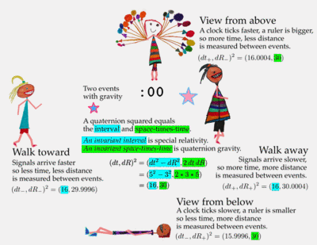
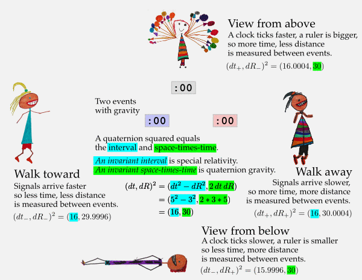

# SR + QG - *S*pecial *R*elativity and *Q*uaternion *G*ravity

This graphic says most of it...

  

[printable pdf](../img/sr_and_qg.all.pdf) or [editable svg](../img/sr_and_qg.all.svg)

My entry to the [_2015 Awards for Essays on 
Gravitation_](http://www.gravityresearchfoundation.org/index.html) is 
[available as a pdf](papers/s-t-t/space-times-time-invariance.pdf).
