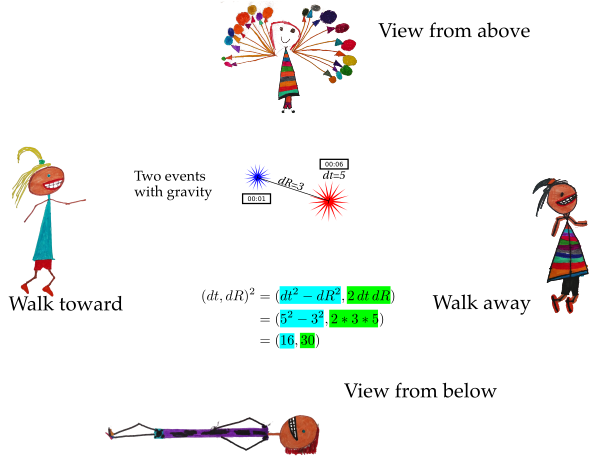

# Measure the difference between space-time events

Firecrackers Explode!

There is a difference in time (dt).

There is a difference in space (dR).

Together they make a difference in space-time.

This site shows how these two simple measurements can be used together to
understand both Special Relativity (the physics of moving) and a new proposal
for gravity, Quaternion Gravity.
