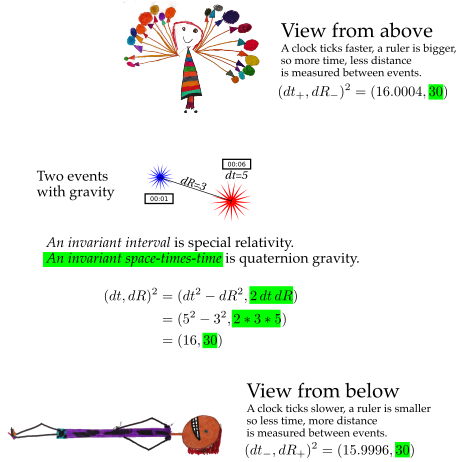

# Quaternion gravity

Looking down or up changes measurements of firecrackers.

If one observer is at a different height in a gravity field to another observer, then quaternion gravity comes into play.

Note: the numbers are **far too big** (off by 16 orders of magnitude, I just
didn't want to write _lots_ of zeros).
