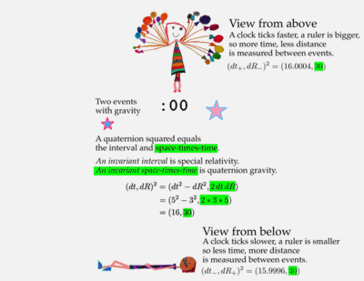

# Quaternion gravity

Looking down or looking from below changes time and space measurements in opposite ways.

  

If one kid is at a different height in a gravity field to another, then
time measurements get smaller while spatial ones get bigger.  That is standard 
physics (general relativity, GR).

The Quaternion Gravity (QG) proposal says the space-times-time values are 
precisely the same.  With general relativity, this space-times-time is not 
mentioned, but it is almost - but not quite - the same.

Note: the numbers are **far too big** (off by 16 orders of magnitude, I just
didn't want to write _lots_ of zeros).

## Page-cast

A brief explantion of this page.

<iframe width="420" height="315" src="https://www.youtube.com/embed/9Z13zO-IsQ8" frameborder="0" allowfullscreen></iframe>

## For nerds only

Special relativity could have been called "special invariance" because it is
the invariant interval that all inertial observers argee upon.  Inviarnce
principles are deep insights into how Nature works.  They are truths that do
not change.

The quaternion gravity proposal postulates a new invariance principle: that
different observers making measurements in different locations in a
gravitational field will agree on an invariant value for space-times-time.
Some care is required to say this in a coordinate-independent way.  All
observers are free to pick their coordinate system.  There then exists a
norm-presurving rotation in space such that the space-times-time measurement of
one observer is exactly equal to another.

Special relativity is not a field field theory.  It is a constraint on all
field theories.  The quaternion gravity proposal is also not a field theory.
Like special relativity, it is a constraint on all field theories.  As such,
there is no need for a graviton.  Quaternion gravity makes the search for
quantum gravity moot.
