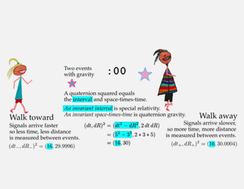

# Special relativity

Walking changes how one measures deadly supernovae.

  

As long as the kids move at a constant rate, special relativity comes into play.

Relativity is not an arbitrary change, but increadibly precise change.

And there is that interval that is *exactly* the same size.

Note: the numbers are **far too big** (off by 16 orders of magnitude, I just
didn't want to write _lots_ of zeros).
