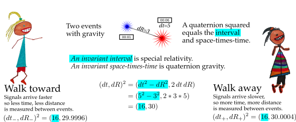

# Special relativity

Walking changes how one measures firecrackers.

If one observer moves at a constant rate to another observer, then special relativity comes into play.

Note: the numbers are **far too big** (off by 16 orders of magnitude, I just
didn't want to write _lots_ of zeros).
